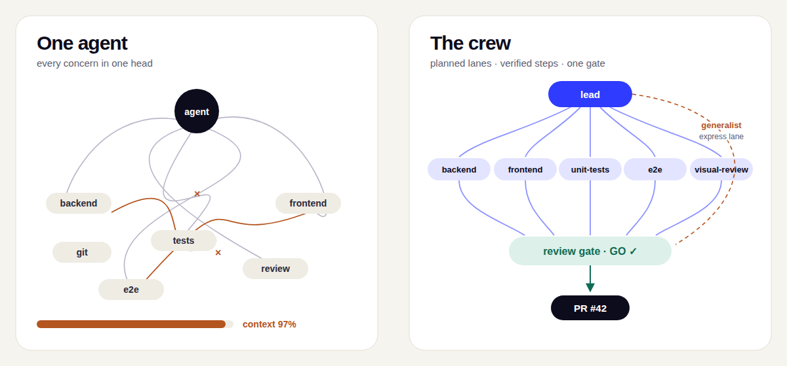

# crew

<!-- Release-tag scheme is `plugin/vX.Y.Z` (see auto-release.yml). The label is
     blanked (`&label=`) so each badge is a single pill of the tag itself, which
     already names the plugin, instead of doubling it up as "crew crew/v3.5.2". -->
[](https://github.com/johantor/crew/releases)
[](https://github.com/johantor/crew/actions/workflows/validate.yml)
[](LICENSE)

**Ship Optimizely features like a team, not a single agent.** crew is a
[Claude Code](https://code.claude.com/docs/en/overview) plugin: a `lead` agent plans the work
and delegates each step to specialists that know the CMS they work in, behind hook-enforced
guardrails and one review gate. It also pays down tech debt, one verified fix at a time.

```bash
claude plugin marketplace add johantor/crew
claude plugin install crew@johantor
```

<!-- Illustration source: docs/solo-vs-crew.svg (edit the SVG, then re-export the PNG). -->


Site: <https://johantor.github.io/crew/>

## Built for Optimizely

One skill per product. The `backend` specialist reads your `EPiServer.CMS` version and loads the
matching skill.

| Skill | Covers | Status |
|---|---|---|
| `optimizely-cms12` | CMS 12 (ASP.NET Core, PaaS/DXP) | Available |
| `optimizely-cms13` | CMS 13 (.NET 10): applications, Graph, Visual Builder | Available |
| `optimizely-cms-upgrade` | The 12 → 13 upgrade | Available |
| `optimizely-graph` | Graph: sync, schemas, keys, querying from .NET and headless front ends | Available |
| `optimizely-cms-saas` | SaaS CMS: content types in code, Visual Builder, live preview | Available |
| `optimizely-search-navigation` | Search & Navigation (Find) on CMS 12, and the move to Graph | Available |
| `optimizely-odp` | Data Platform: events, profiles, real-time audiences for CMS and Experimentation | Available |
| `optimizely-opal` | Opal custom tools: the discovery contract, registries, auth | Available |
| `optimizely-opal-tools-dotnet` / `-node` / `-python` | One skill per Opal tools SDK (C#, TypeScript, Python) | Available |
| Commerce, OCP, Experimentation | | Planned ([#273](https://github.com/johantor/crew/issues/273)) |

Stacks: .NET, Node, Python (for Opal tools) and shell on the backend; React and Next.js on the
front end.

## The crew

| Agent | Role |
|---|---|
| `lead` | Plans, waits for your go-ahead, delegates, and commits each verified step. The only agent that runs git. |
| `backend` | Server code for your stack, with the Optimizely skill for your CMS version. |
| `frontend` | The client-facing layer, including Razor markup in server-rendered mode. |
| `unit-tests` | Backend tests, plus frontend component tests when a tool is configured. |
| `e2e` | Browser tests with Playwright or Cypress. |
| `visual-review` | Checks the build against the design (read-only). |
| `generalist` | The express lane for small, low-risk changes. |
| `incident-triage` | Traces a production signal to the code and the suspect commits (read-only). |
| `debt-scout` | Scouts a scope for tech debt and returns pointers (read-only). |

## Quick start

```bash
claude --agent crew:lead     # a dedicated session: just describe the work
```

or, from a normal session:

```
/crew:init                 # once per project: record the stack and the build/test/lint commands
/crew:feature <task>       # plan, delegate, build, then stop at the gate
/crew:review               # GO / NO-GO: code, security and design review, build/test/lint
/crew:pr                   # push the branch and open the pull request
/crew:address              # route PR comments and CI failures back to the crew
/crew:triage <signal>      # a bug report, trace or alert -> the code and the suspect commits
/crew:debt <pointer>       # fix one debt item: a suppression, a rule, a package upgrade (beta)
```

`lead` presents its plan before building, commits each verified step to a feature branch, and
runs workers in the background so you can keep talking to it. Nothing is pushed and no PR is
opened until you say so.

## Requirements

- [Claude Code](https://code.claude.com/docs/en/overview) with plugin support (CLI, desktop, or
  IDE extension).
- A git repository: crew branches and commits its work.
- Optional: Playwright, Figma, and GitHub or Azure DevOps MCP servers, for visual review and PR
  workflows. Setup is in the [crew README](plugins/crew/README.md).

You can also install from the UI: run `/plugin` in Claude Code and browse to **Discover**.

## Updating and uninstalling

```bash
claude plugin marketplace update johantor    # refresh the plugin catalog
claude plugin update crew@johantor           # update the plugin
claude plugin uninstall crew@johantor        # remove it
```

Release notes: [CHANGELOG](plugins/crew/CHANGELOG.md).

## Documentation

- [crew](plugins/crew/README.md): agents, commands, hooks, background delegation and MCP setup.
- [AGENTS.md](AGENTS.md): contributing and hacking on the crew.

## License

[Apache-2.0](LICENSE). The plugin collects no data and sends nothing to the maintainers; see
[PRIVACY.md](PRIVACY.md). An independent project, not affiliated with or endorsed by Optimizely
or Anthropic.
